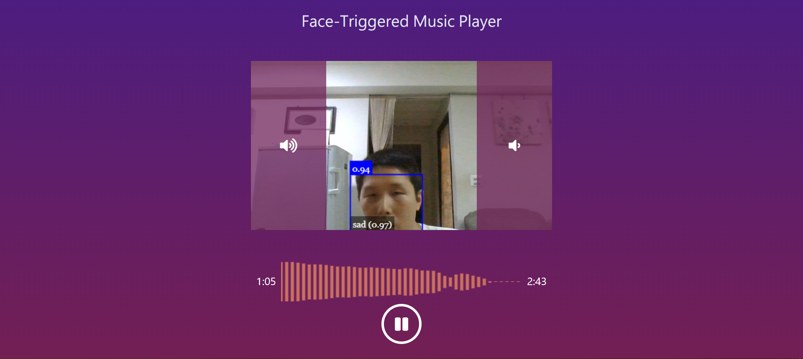

# Face-Based Music Player
music can be controled by two ways --- face or mouse

Features:
- music can be played/paused by doing a surprised expression or by clicking button
- audio waveform
- move your face to volume up/down area(more than half face) can control music volume
- animation will show when music control is triggered

[Demo](https://kalpaswang.github.io/face-based-music-player/)